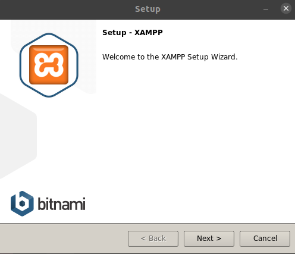
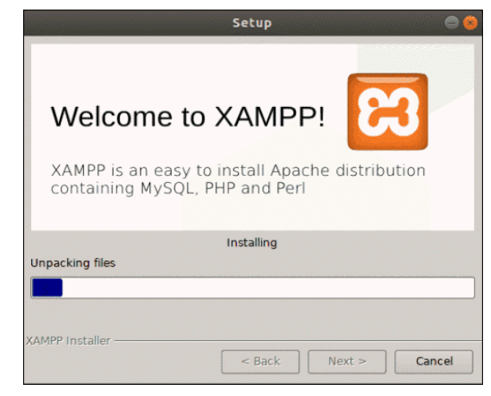
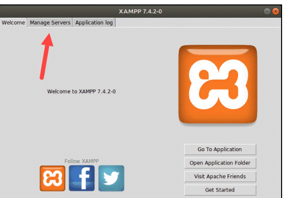
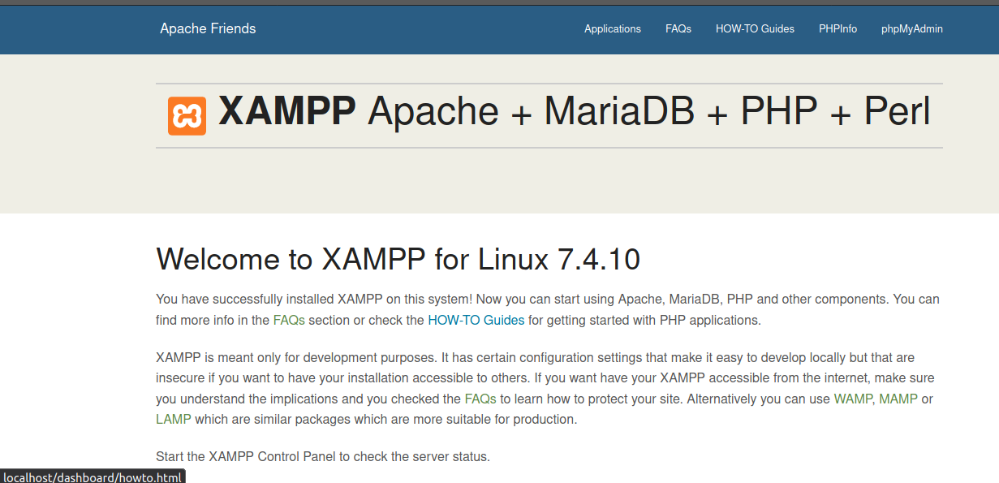
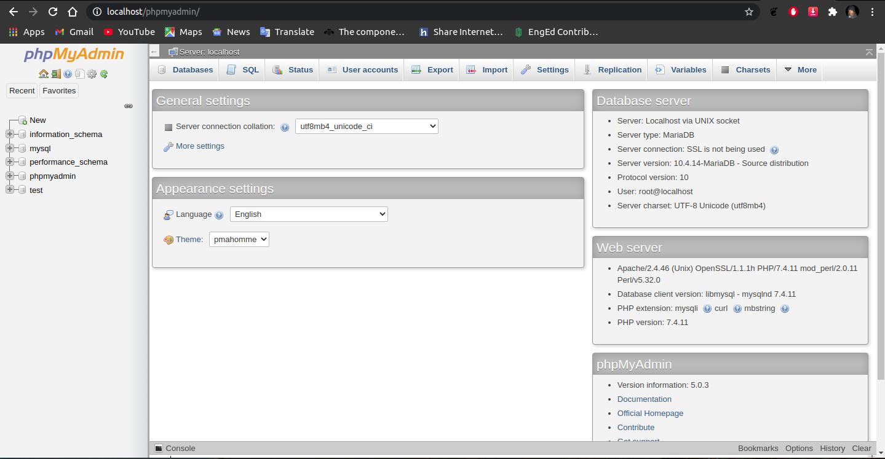
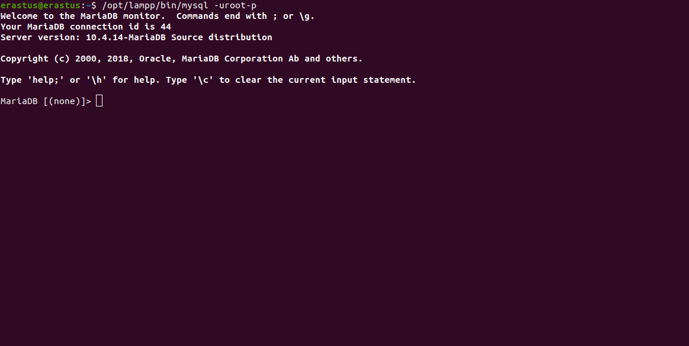
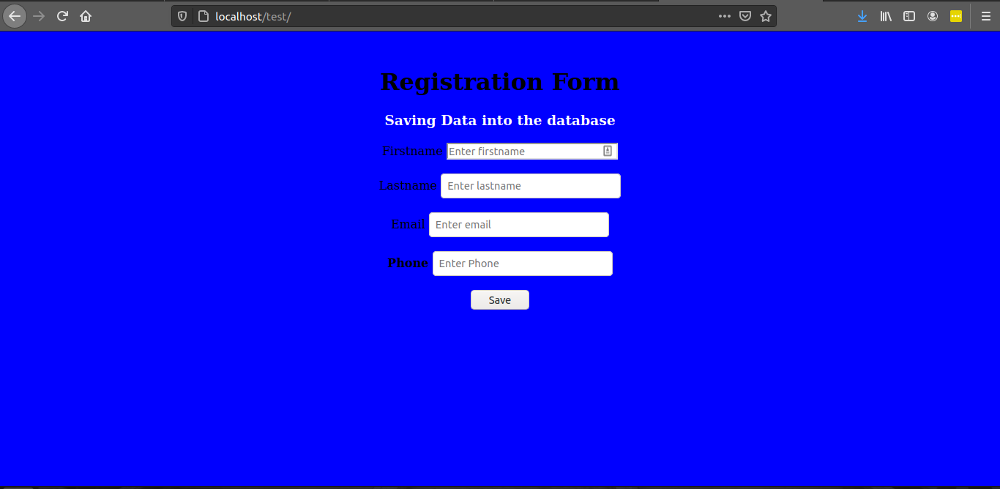
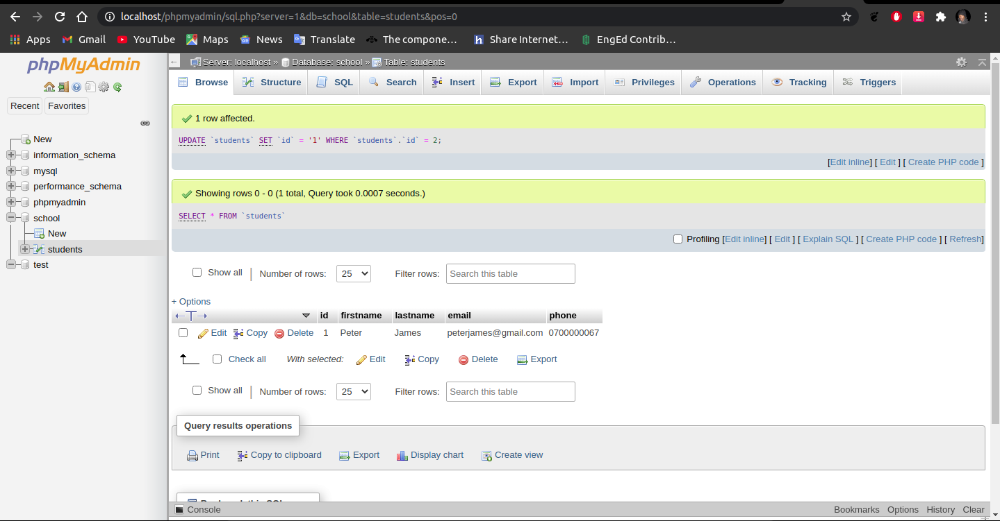
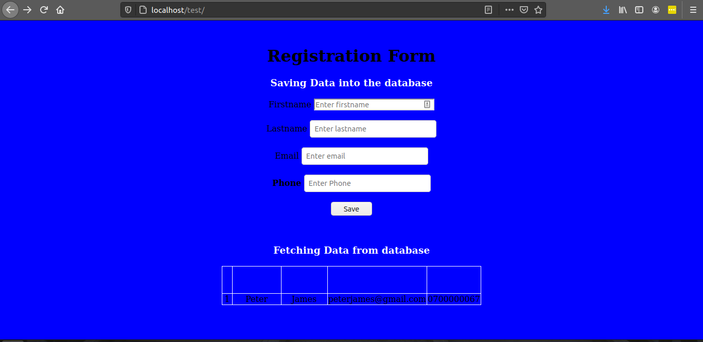

### Creating, Connecting, Storing, and fetching data from MariaDatabase using PHP 
Working with the Database seems to be  very complicated in a Developer's coding life. But to me, this is not the case. In this article, we will prove how easy it is to work with MariaDatabase with only SQL and PHP knowledge.
### Prerequisites
To use this tutorial you need to ;
- have `HTML` and `CSS` knowledge
- have a working code editor live visual studio code. Download it [here](https://code.visualstudio.com/download).
- be a user with Sudo privilege
- access to terminal/command line

In this article you will learn how to;
- install Xampp
- create  tables in Database using SQL commands
- create a registration form using 
- store data from the registration form into the database
- fetch the saved data from the Database  
### Step 1: Installing Xampp
Xampp comes along with PhpMyAdmin when downloaded into a machine.  PhpMyAdmin is the MariaDatabase that we will be working on within this article.

To install Xampp you need to;
### . Download the package to be installed.
Downloading the package is always the first step you need to do when installing Xampp. You can download the package [here](https://www.apachefriends.org/download.html). Download the latest version of Xampp for Linux and start the installation. Very easy.
### . Give the package permission so that it can be executable
To make this package executable, you need to open the terminal (Ctrl+alt+T) and follow the following:

1. Move to where your package is located. In my case,  it is in the Downloads folder and so I will navigate to the Downloads folder using this command:
```bash
$ cd /home/[username]/Downloads

```
2. Run the Chmod command (sudo chmod 755 [package name] )to make the package file executable.

The  Xampp version may differ. In my case I have then following:
```bash
$ sudo chmod 755 xampp-linux-x64-7.4.10-0-installer.run
```
 Navigate to your package and copy the file name like the one we have above and then paste it into the terminal.

3. With the above command, the terminal will not output anything. Verify that we have executed the permission with the command below:
```bash
$  ls -l xampp-linux-x64-7.4.10-0-installer.run
```
Here, this is the output you will get.
```bash
-rwxrwxrwx 1 [username] [username] 157293721 Sep 12 22:23 xampp-linux-x64-7.4.10-0-installer.run
```
The username above is the user who can execute the file.
### . Launch  Setup Wizard
1. It's now time to run the installer and launch the setup wizard. To do this, use the following command:
```bash
$ sudo ./xampp-linux-x64-7.4.10-0-installer.run
```
2. When you click enter in the above command, you should have XAMPP Setup Wizard opens as the image below:


### . Select Components dialogue
1. You should click ``Next`` in the above image and Select Components dialogue. You should choose either XAMPP Core Files or Xampp Developer Files and install. You may keep the default setting and proceed with `Next`

2. The Setup will show you where the software will be installed. The location should be `/opt/lampp`. Click `Next` to proceed.

3. After clicking next, you should see a dialogue box installing applications. Uncheck  `Learn more about Bitnami for XAMPP` to deny and click `Next`.

4. Xampp is now ready to be installed by the Wizard. Start the installation by clicking `Next`.

5. The Installation process should start immediately as in the figure below.


### . Launching Xampp
When you click next, the Xampp control panel will be displayed on the screen as in the figure below:

In the Manage Serves tab, click `Start` to start all the services.
### . Verifying that XAMPP is running
Here we are going to verify that we have installed two things. The `localhost` and the `MariaDB`
1. For localhost enter the following URL in a browser: http://localhost/dashboard
If You see an image like the one below, the Xampp is installed in your machine.

2. For MariaDB open the URL: http://localhost/phpmyadmin/
Your browser should look like this;


### Step 2: Creating tables in MariaDB using SQL commands in the terminal.
Now that we have our environment working, we can start working with the MariaDB. 

In the terminal, type;
```bash
$ /opt/lampp/bin/mysql -u root -p
```
The terminal will ask you for a password, click enter as we have not set any password.

When you click enter you should have the following output:


In the above diagram, it means that you are now working on the MariaDatabase.

The next thing to do is to create a Database. Let's create a Database called school. Type:
```bash
create database school;
```
`Query OK, 1 row affected (0.000 sec)
` should be your output.

To confirm that you have created a Database school, use this command:
```bash
show databases;
```
The terminal should display  `Database` `school`  only since this is the only `Database` we have.

Now let's navigate inside `database school` and create tables. To do this, we will use the SQL command `use`. Type:
```bash
 use school;
```
`Database changed` should be the terminal output.

Now that we are in `database school` we can create tables. Lets create a table students;
```bash
create table students(
    id int(11) not null AUTO_INCREMENT primary key,
    firstname varchar(50) not null,
    lastname varchar(20) not null,
    email varchar(56) not null,
    phone varchar(15) not null);
```
For output of the tables above, enter this command:
```bash
desc students;
```
The output should be as this image below;


So far, we have created a `database school` and  `tables` inside the school Database via terminal. Now, let's view this database school and its tables in the MariaDB. When you open the URL: http://localhost/phpmyadmin/  you should have an image like this.


### Step 3: Creating a registration form
1. Here, we will create a form and store the details of that form in our database.

In step 1, we had said that Xampp will be installed in `/opt/lampp`. Inside `/opt/lampp/htdocs` create a folder called `test`. To do this open `/htdocs` using terminal.
```bash
[username]@[username]:/opt/lampp/htdocs$ 
``` 
To create folder `test`, type the following in the terminal:
```bash
$ sudo mkdir test
```
Let's now navigate inside the `test` folder and create two files. Use this command to navigate inside the `test` folder:
```bash
$ cd test
```
You should have this output `[usename]@[username]:/opt/lampp/htdocs/test$`

To create the first file, type:
```bash
$ sudo nano index.php
```
After clicking enter, a page with the title `index.php` will open. Close this page and use another suitable code editor. To close click(ctrl+O)followed by (ctrl+enter) followed by(ctrl+x). This will take you back to the terminal.

Create a second file:
```bash
$ sudo nano connect.php
```
Note. To close `connect.php` page follow the same procedure you have done in `index.php`

2. Open `test` folder using your favorite code editor and enter the following in `index.php`.
```html
<!DOCTYPE html>
<html>
 <head>
 <title>Working with the database </title>
 
 </head>
<body>
 <h1>Registration Form</h1>
 <h3>Saving Data into the database</h3>
 <form action="connect.php" method="POST">
        Firstname
 <input type="text" placeholder="Enter firstname" name="firstname" required ="true">
 <br> <br>
        Lastname
 <input type="text" placeholder="Enter lastname" name="lastname" required ="true">
 <br> <br>
        Email
 <input type="email" placeholder="Enter email" name="email" required ="true">
 <br> <br>
        Phone
 <input type="phone" placeholder="Enter Phone" name="phone" required ="true">
 <br> <br> 
 <button type="submit" class="btn btn-lg btn-primary btn-block">  Save </button>
</form> 
</body>
</html>
```
Note:If you try to save the file `index.php`, you will get an error `failed to save index.php`, since your working in an environment that requires user permission. To solve the error select `click Retry as Sudo and enter your password`. This is how we will be saving our files in this article. The error is as the image below:


To test the form above using a browser, open URL: http://localhost/test 

To style the html form you have created above enter the following code after `</form>`
```css
<style>
body
  {
 
 text-align: center;
 padding-top: 20px;
 background-color: blue;
  }
 h3{
 color: white;
  }
</style>
```
When you open the URL: http://localhost/test , you should have a page like this on your browser;

3. Now we connect our form with the database. Inside connect.php enter this code:
```php
<?php
//Database records.The records we have in the database
$firstname = $_POST['firstname'];
$lastname = $_POST['lastname'];
$email = $_POST['email'];
$phone = $_POST['phone'];


//Making DataBase connection
$servername ='localhost';
$username ='root';
$password ='';
$dbname ='school';

$conn = new mysqli("localhost","root",'',"school");

//Checking for errors and inserting data into the database

if($conn-> connect_error)
{
 die('connection failed :' .$conn-> $connect_error);
}
 else{
 $sql = ("INSERT INTO students(firstname,lastname,email,phone)
 VALUES ('$firstname','$lastname','$email','$phone')");
 
 }
//   var_dump($sql); 'exit'; This helps you identify the error incase there is an $sql error
$sql = mysqli_query($conn, $sql);
// $sql conditions which will be displayed after clicking save button
if($sql == true)
{
 echo "Records saved";
}
else
{
 echo "Records not saved  ";
}

?> 

```
### Step 4: Storing data into the database
If we fill our form that we created(URL: http://localhost/test ) with the below details and save it, our `school database `should have the same details.

Firstname-Peter

Lastname-James

Email- peterjames@gmail.com

Phone-0700000067

When we call http://localhost/phpmyadmin/ on the browser we should have something like this in our data.


### Step 5: Fetching data from the Database
To fetch data that we have saved, we will add some code inside `index.php`. The code will be added below `</form>`.
```PHP
<br> <br>
 //Creating a table where data from database will be stored
 <h3>Fetching Data from database</h3>
 <table align="center" style="width:300px;">
 <tr>
 <th>id</th>
 <th>Firstname</th>
 <th>Lastname</th>
 <th>Email</th>
 <th>Phone</th>
 </tr>
 
        <?php
 //database connection
 $conn = new mysqli("localhost","root",'',"school");
 //checking for errors
 if($conn->connect_error)
          {
 die("Error in DB connection: ".$conn->connect_errno." : ".$conn->connect_error);    
          }
 
 $select = "SELECT * FROM `students` ORDER BY id";
 $result = $conn->query($select);
 //displaying data from MariaDB on a browser using while loop
 while($row = mysqli_fetch_array($result))  
          {  
          ?> 
 
          <tr>  
 
               <td><?php echo $row["id"]; ?></td>  
               <td><?php echo $row["firstname"]; ?></td>  
               <td><?php echo $row["lastname"]; ?></td> 
               <td><?php echo $row["email"]; ?></td> 
               <td><?php echo $row["phone"]; ?></td> 
 
          </tr>  
          <?php  
          }  
          ?> 
 
     </table>
 
```
On refreshing the page, ( http://localhost/test) we have;

The data at the bottom of the page have been fetched from the database.
### Conclusion
From this article, we have learned that working with a Database is as easier as working with any other code. and we have concluded that it is a myth to say that Database is the only meant for backend expert only.